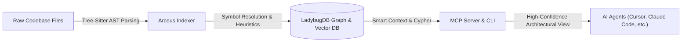
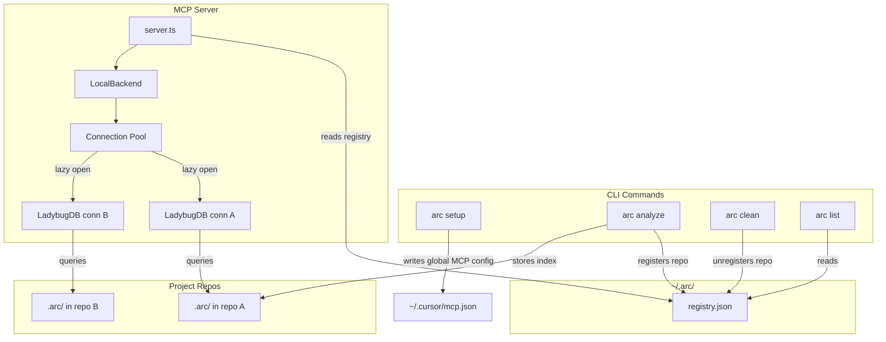

# Arceus

**Building the nervous system for AI agent context.**

Indexes any codebase into a highly structured knowledge graph—tracking every class, function, call chain, cluster, and cross-file execution flow—then exposes it through smart tools so AI agents never operate blind.



> *Arceus provides a deep relational view of your codebase.* Traditional tools help you locate code snippets. Arceus lets you analyze the entire system—because its knowledge graph maps actual compiler-resolved dependencies and execution flows, not just lexical occurrences.

> The **Web UI** offers a visual graph explorer and a browser-based AI chat. The **CLI + MCP** is designed to make your AI agents reliable. It gives Cursor, Claude Code, Windsurf, and other editors a deep architectural view of your codebase so they stop missing dependencies, breaking call chains, and making blind modifications.

---

**Live-link:** [arceus-arc.vercel.app](https://arceus-arc.vercel.app)

---

## Two Ways to Use Arceus

|                   | **CLI + MCP**                                            | **Web UI**                                             |
| ----------------- | -------------------------------------------------------------- | ------------------------------------------------------------ |
| **What**          | Index repos locally, connect AI agents via MCP                 | Visual graph explorer + AI chat in browser                   |
| **For**           | Daily development with Cursor, Claude Code, Windsurf, OpenCode  | Quick exploration, demos, one-off analysis                   |
| **Scale**         | Full repos, any size                                           | Limited by browser memory (~5k files), or unlimited via backend mode |
| **Install**       | `npm install -g arceus-s`                                    | No install — browser-only or connect to local `arc serve`    |
| **Storage**       | LadybugDB native (fast, persistent)                            | LadybugDB WASM (in-memory, per session)                      |
| **Parsing**       | Tree-sitter native bindings                                    | Tree-sitter WASM                                             |
| **Privacy**       | Everything local, no network                                   | Everything in-browser, no server                             |

> **Bridge mode:** `arc serve` connects the two — the web UI auto-detects the local server and can browse all your CLI-indexed repos without re-uploading or re-indexing.

---

## Enterprise

Arceus is available as an **enterprise offering** - either as a fully managed **SaaS** or a **self-hosted** deployment. Also available for **commercial use** of the OSS version with proper licensing.

Enterprise includes:
- **PR Review** - automated blast radius analysis on pull requests
- **Auto-updating Code Wiki** - always up-to-date documentation (Code Wiki is also available in OSS)
- **Auto-reindexing** - knowledge graph stays fresh automatically
- **Multi-repo support** - unified graph across repositories
- **OCaml support** - additional language coverage
- **Priority feature/language support** - request new languages or features

**Upcoming:**
- Auto regression forensics
- End-to-end test generation
---

## Development

- [ARCHITECTURE.md](ARCHITECTURE.md) — packages, index → graph → MCP flow, where to change code
- [RUNBOOK.md](RUNBOOK.md) — analyze, embeddings, stale index, MCP recovery, CI snippets
- [GUARDRAILS.md](GUARDRAILS.md) — safety rules and operational "Signs" for contributors and agents
- [CONTRIBUTING.md](CONTRIBUTING.md) — license, setup, commits, and pull requests
- [TESTING.md](TESTING.md) — test commands for `arc` and `arceus-web`

---

## CLI + MCP (Recommended)

The CLI indexes your repository and runs an MCP server that gives AI agents deep codebase awareness.

### Naming & Global Command Installer
Because the command name `arc` is extremely common and already registered by an unrelated package on the public npm registry, **Arceus CLI is published under the package name `arceus-s`**. 

When installed globally, npm maps the CLI binary to the command **`arc`**, letting you use the tool natively:
```bash
# Install globally from npm
npm install -g arceus-s

# Run commands globally
arc analyze
arc setup
```

### Quick Start

```bash
# Index your repo (run from repo root)
npx arceus-s analyze
```

This indexes the codebase, installs agent skills, registers Claude Code hooks, and creates `AGENTS.md` / `CLAUDE.md` context files — all in one command.

To configure MCP for your editors, run `arc setup` once (or use `npx arceus-s setup` if not installed globally).

> **Faster install (no C++ toolchain needed):** set `ARC_SKIP_OPTIONAL_GRAMMARS=1` before installing globally or running with npx to skip the native `tree-sitter-dart` and `tree-sitter-proto` builds. Dart/Proto files won't be parsed, but install completes in seconds without local compilation toolchains.

---

### MCP Setup

`arc setup` auto-detects your editors and writes the correct global MCP config. You only need to run it once.

### Editor Support

| Editor          | MCP | Skills | Hooks (auto-augment) | Support        |
| --------------- | --- | ------ | -------------------- | -------------- |
| **Claude Code** | Yes | Yes    | Yes (PreToolUse + PostToolUse) | **Full** |
| **Cursor**      | Yes | Yes    | Yes (postToolUse, [manual install](arceus-cursor-integration/README.md#hook-install)) | **Full** |
| **Codex**       | Yes | Yes    | —                   | MCP + Skills   |
| **Windsurf**    | Yes | —      | —                   | MCP            |
| **OpenCode**    | Yes | Yes    | —                   | MCP + Skills   |

> **Claude Code** gets the deepest integration: MCP tools + agent skills + PreToolUse hooks that enrich searches with graph context + PostToolUse hooks that detect a stale index after commits and prompt the agent to reindex.

---

### Manual Editor Setup (MCP)

> **Recommended for fastest startup:** install `arceus-s` globally (`npm i -g arceus-s`) and run `arc setup` — this writes an absolute-path MCP config that bypasses `npx` entirely. The pinned-`npx` snippets below are a quickstart fallback; on a cold cache the `npx` install can exceed editor timeout limits.

**Claude Code** (full support — MCP + skills + hooks):

```bash
# macOS / Linux
claude mcp add arceus -- npx -y arceus-s@latest mcp

# Windows
claude mcp add arceus -- cmd /c npx -y arceus-s@latest mcp
```

**Codex** (full support — MCP + skills):

```bash
codex mcp add arceus -- npx -y arceus-s@latest mcp
```

**Cursor** (`~/.cursor/mcp.json` — global, works for all projects):

```json
{
  "mcpServers": {
    "arceus": {
      "command": "npx",
      "args": ["-y", "arceus-s@latest", "mcp"]
    }
  }
}
```

**OpenCode** (`~/.config/opencode/config.json`):

```json
{
  "mcp": {
    "arceus": {
      "type": "local",
      "command": ["arc", "mcp"]
    }
  }
}
```

**Codex** (`~/.codex/config.toml` for system scope, or `.codex/config.toml` for project scope):

```toml
[mcp_servers.arceus]
command = "npx"
args = ["-y", "arceus-s@latest", "mcp"]
```

---

### CLI Commands

```bash
arc setup                     # Configure MCP for your editors (one-time)
arc analyze [path]            # Index a repository (or update stale index)
arc analyze --force           # Force full re-index
arc analyze --skills          # Generate repo-specific skill files from detected communities
arc analyze --skip-embeddings # Skip embedding generation (faster)
arc analyze --skip-agents-md  # Preserve custom AGENTS.md/CLAUDE.md arc section edits
arc analyze --skip-git        # Index folders that are not Git repositories
arc analyze --embeddings      # Enable embedding generation (slower, better search)
arc analyze --verbose         # Log skipped files when parsers are unavailable
arc analyze --worker-timeout 60  # Increase worker idle timeout for slow parses
arc mcp                       # Start MCP server (stdio) — serves all indexed repos
arc serve                     # Start local HTTP server (multi-repo) for web UI connection
arc list                      # List all indexed repositories
arc status                    # Show index status for current repo
arc clean                     # Delete index for current repo
arc clean --all --force       # Delete all indexes
arc wiki [path]               # Generate repository wiki from knowledge graph
arc wiki --model <model>      # Wiki with custom LLM model (default: gpt-4o-mini)
arc wiki --base-url <url>     # Wiki with custom LLM API base URL
arc publish                   # Notify the understand-quickly registry (opt-in)

# Repository groups (multi-repo / monorepo service tracking)
arc group create <name>                                   # Create a repository group
arc group add <group> <groupPath> <registryName>          # Add a repo to a group.
arc group remove <group> <groupPath>                      # Remove a repo from a group by path
arc group list [name]                                     # List groups, or show one group's config
arc group sync <name>                                     # Extract contracts and match across services
arc group contracts <name>                                # Inspect extracted contracts and cross-links
arc group query <name> <q>                                # Search execution flows across all repos in a group
arc group status <name>                                   # Check staleness of repos in a group
```

---

### What Your AI Agent Gets

**16 tools** exposed via MCP (11 per-repo + 5 group):

| Tool               | What It Does                                                      | `repo` Param |
| ------------------ | ----------------------------------------------------------------- | ------------ |
| `list_repos`       | Discover all indexed repositories                                 | —            |
| `query`            | Process-grouped hybrid search (BM25 + semantic + RRF)             | Optional     |
| `context`          | 360-degree symbol view — references, hierarchy, and flows         | Optional     |
| `impact`           | Blast radius analysis with depth grouping and confidence          | Optional     |
| `detect_changes`   | Git-diff impact — maps changed lines to affected processes        | Optional     |
| `rename`           | Multi-file coordinated rename with graph + text search            | Optional     |
| `cypher`           | Raw Cypher graph queries                                          | Optional     |
| `group_list`       | List configured repository groups                                 | —            |
| `group_sync`       | Extract contracts and match across repos/services                 | —            |
| `group_contracts`  | Inspect extracted contracts and cross-links                       | —            |
| `group_query`      | Search execution flows across all repos in a group                | —            |
| `group_status`     | Check staleness of repos in a group                               | —            |

> When only one repo is indexed, the `repo` parameter is optional. With multiple repos, specify which one: `query({query: "auth", repo: "my-app"})`.

**Resources** for instant context:

| Resource                                  | Purpose                                              |
| ----------------------------------------- | ---------------------------------------------------- |
| `arc://repos`                             | List all indexed repositories (read this first)      |
| `arc://repo/{name}/context`               | Codebase stats, staleness check, and available tools |
| `arc://repo/{name}/clusters`              | All functional clusters with cohesion scores         |
| `arc://repo/{name}/cluster/{name}`        | Cluster members and details                          |
| `arc://repo/{name}/processes`             | All execution flows                                  |
| `arc://repo/{name}/process/{name}`        | Full process trace with steps                        |
| `arc://repo/{name}/schema`                | Graph schema for Cypher queries                      |

**2 MCP prompts** for guided workflows:

| Prompt             | What It Does                                                              |
| ------------------ | ------------------------------------------------------------------------- |
| `detect_impact`    | Pre-commit change analysis — scope, affected processes, risk level        |
| `generate_map`     | Architecture documentation from the knowledge graph with mermaid diagrams |

**4 agent skills** installed to `.claude/skills/` automatically:
- **Exploring** — Navigate unfamiliar code using the knowledge graph
- **Debugging** — Trace bugs through call chains
- **Impact Analysis** — Analyze blast radius before changes
- **Refactoring** — Plan safe refactors using dependency mapping

---

## Context Efficiency & Token Optimization (Benchmark)

Arceus's semantic graph model drastically reduces token wastage and context pollution for downstream LLMs compared to traditional lexical exploration (e.g., recursive grep and file reading).

### Quantitative Efficiency Comparison

| Inquiry Scenario | Lexical Method (Grep + Full File Read) | Semantics-Guided (MCP / Cypher Query) | Token Conservation Ratio | Impact & Efficiency Gain |
| :--- | :--- | :--- | :--- | :--- |
| **1. Call-Site Tracing** <br> Retrieve all calling methods and files invoking `withLbugDb`. | **~21,000 tokens** <br>(Requires scanning grep results, opening and parsing `api.ts` [69.6KB] and `lbug-adapter.ts` [14.4KB] to locate calling signatures). | **~28 tokens** <br>(Cypher execution: returns a targeted JSON array referencing the exact caller `handler` in `api.ts`). | **750x Reduction** <br>(99.87% Saved) | **Critical Path Tracing**: Eliminates ingestion of unrelated implementation details, preserving LLM context window. |
| **2. API Route Mapping** <br> Discover all registered endpoints and handler files. | **~20,162 tokens** <br>(Requires reading multiple route-registration files, middleware modules, and unit test suites). | **~65 tokens** <br>(Cypher execution: fetches all `Route` nodes containing route paths and source locations). | **310x Reduction** <br>(99.68% Saved) | **Interface Discovery**: Obtains complete routing topography without feeding entire source files to the LLM. |
| **3. Monorepo Class Indexing** <br> Index all classes and paths in the workspace. | **~87,500 tokens** <br>(Requires reading over 20 files containing class structures to capture inheritance and signatures). | **~1,250 tokens** <br>(Cypher execution: returns a complete node list of all `Class` names and file paths). | **70x Reduction** <br>(98.57% Saved) | **Architecture Mapping**: Instant monorepo-wide indexing with minimal network and computational overhead. |

### Architectural Advantages

1. **Deterministic Precision (Zero Noise)**: Lexical tools like grep require models to ingest noise (boilerplates, imports, formatting, unrelated logic) to resolve relationships. Arceus returns only the exact requested graph nodes and edges.
2. **Multi-Hop Traversal**: Tracing transitive chains (e.g., `Class A extends Class B implements Interface C`) normally requires iterative lexical searches. A single Cypher query (e.g., `MATCH (a:Class)-[:EXTENDS]->(b)-[:IMPLEMENTS]->(c) RETURN a, c`) evaluates this instantly on the graph.
3. **Optimized Concurrency**: Read-only graph locking ensures concurrent MCP context retrieval does not block editor processes, runtime tasks, or local file systems.

---

## Multi-Repo MCP Architecture

Arceus uses a **global registry** so one MCP server can serve multiple indexed repos. No per-project MCP config needed — set it up once and it works everywhere.



**How it works:** Each `arc analyze` stores the index in `.arc/` inside the repo (portable, gitignored) and registers a pointer in `~/.arc/registry.json`. When an AI agent starts, the MCP server reads the registry and can serve any indexed repo. LadybugDB connections are opened lazily on first query and evicted after 5 minutes of inactivity (max 5 concurrent).

---

## Web UI (Browser-based)

A client-side graph explorer and AI chat — your code never leaves your machine.

**Try it now:** [arceus-arc.vercel.app](https://arceus-arc.vercel.app) — run `arc serve` (or `npx arceus-s serve`) locally and the page auto-connects to your local backend.

Or run the frontend locally:

```bash
git clone https://github.com/Sirius6907/Arceus.git
cd Arceus/arceus-shared && npm install && npm run build
cd ../arceus-web && npm install
npm run dev
# Then in another terminal, start the backend the frontend connects to:
npx arceus-s@latest serve
```

---

## Docker

The official Docker setup ships **two signed images** orchestrated by `docker-compose.yaml`. Each image is published to both **GitHub Container Registry** (GHCR) and **Docker Hub**:

| Purpose                                                           | GHCR (default in `docker-compose.yaml`)       | Docker Hub mirror                      |
| ----------------------------------------------------------------- | --------------------------------------------- | -------------------------------------- |
| CLI / `arc serve` backend (HTTP API on port `4747`, MCP, indexer) | `ghcr.io/Sirius6907/arc:latest`               | `akonlabs/arc:latest`                  |
| Static web UI (port `4173`)                                       | `ghcr.io/Sirius6907/arceus-web:latest`        | `akonlabs/arceus-web:latest`           |

### One-command setup

```bash
docker compose up -d
```

This starts the server on `http://localhost:4747` and the web UI on `http://localhost:4173`. 

A named volume (`arc-data`) persists the global registry, indexes, and cloned repos at `/data/arc` inside the server container. To make repos on your host machine indexable, set `WORKSPACE_DIR` before bringing the stack up:

```bash
WORKSPACE_DIR=$HOME/code docker compose up -d
# Mounts the workspace inside the container.
docker compose exec arc-server arc index /workspace/my-repo
```

### Versioning & Supply-Chain Protection

Both images are signed with [Cosign keyless signing][cosign-keyless] using the workflow's GitHub OIDC identity, and shipped with build provenance and SBOM attestations. This protects against supply-chain attacks. Always verify before pulling:

```bash
cosign verify ghcr.io/Sirius6907/arc:latest \
  --certificate-identity-regexp '^https://github\.com/Sirius6907/Arceus/\.github/workflows/docker\.yml@refs/tags/v[0-9]+\.[0-9]+\.[0-9]+(-[a-zA-Z0-9.]+)?$' \
  --certificate-oidc-issuer https://token.actions.githubusercontent.com
```

[cosign-keyless]: https://docs.sigstore.dev/cosign/signing/overview/

---

## Supported Languages

| Language | Imports | Named Bindings | Exports | Heritage | Type Annotations | Constructor Inference | Config | Frameworks | Entry Points |
|----------|---------|----------------|---------|----------|-----------------|---------------------|--------|------------|-------------|
| TypeScript | ✓ | ✓ | ✓ | ✓ | ✓ | ✓ | ✓ | ✓ | ✓ |
| JavaScript | ✓ | ✓ | ✓ | ✓ | — | ✓ | ✓ | ✓ | ✓ |
| Python | ✓ | ✓ | ✓ | ✓ | ✓ | ✓ | ✓ | ✓ | ✓ |
| Java | ✓ | ✓ | ✓ | ✓ | ✓ | ✓ | — | ✓ | ✓ |
| Kotlin | ✓ | ✓ | ✓ | ✓ | ✓ | ✓ | — | ✓ | ✓ |
| C# | ✓ | ✓ | ✓ | ✓ | ✓ | ✓ | ✓ | ✓ | ✓ |
| Go | ✓ | — | ✓ | ✓ | ✓ | ✓ | ✓ | ✓ | ✓ |
| Rust | ✓ | ✓ | ✓ | ✓ | ✓ | ✓ | — | ✓ | ✓ |
| PHP | ✓ | ✓ | ✓ | — | ✓ | ✓ | ✓ | ✓ | ✓ |
| Ruby | ✓ | — | ✓ | ✓ | — | ✓ | — | ✓ | ✓ |
| Swift | — | — | ✓ | ✓ | ✓ | ✓ | ✓ | ✓ | ✓ |
| C | — | — | ✓ | — | ✓ | ✓ | — | ✓ | ✓ |
| C++ | — | — | ✓ | ✓ | ✓ | ✓ | — | ✓ | ✓ |
| Dart | ✓ | — | ✓ | ✓ | ✓ | ✓ | — | ✓ | ✓ |

---

## Security & Privacy

- **CLI**: Everything runs locally on your machine. No network calls. Index stored in `.arc/` (gitignored). Global registry at `~/.arc/` stores only paths and metadata.
- **Web**: Everything runs in your browser. No code uploaded to any server. API keys stored in localStorage only.
- Open source — audit the code yourself.

---

## Acknowledgments

- [Tree-sitter](https://tree-sitter.github.io/) — AST parsing
- [LadybugDB](https://ladybugdb.com/) — Embedded graph database with vector support (formerly KuzuDB)
- [Sigma.js](https://www.sigmajs.org/) — WebGL graph rendering
- [transformers.js](https://huggingface.co/docs/transformers.js) — Browser ML
- [Graphology](https://graphology.github.io/) — Graph data structures
- [MCP](https://modelcontextprotocol.io/) — Model Context Protocol

---

## License

Copyright (c) 2026 Chandan Kumar Behera

Licensed under the Apache License, Version 2.0. See [LICENSE](LICENSE) for details.
