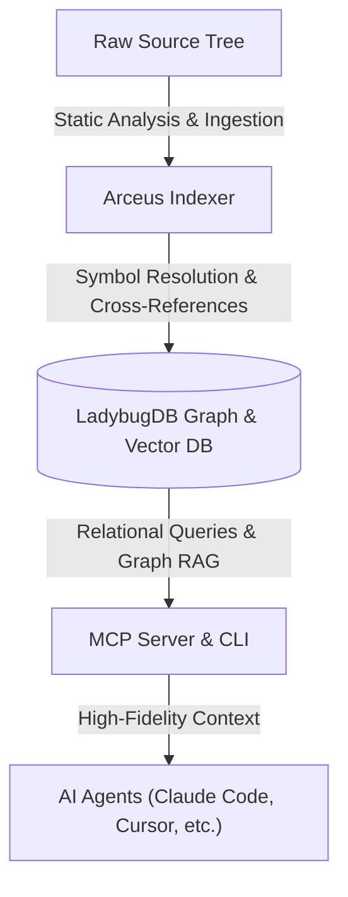

# Arceus: High-Performance Graph-Relational Codebase Indexer & AI Context Engine

Arceus is a local-first static analysis engine and code graph database. It is designed to solve the "context window fatigue" of downstream AI agents (such as Claude Code, Cursor, and Windsurf) by representing a codebase as a queryable graph. 

By analyzing compiler-grade dependencies, lexical scopes, and execution flows, Arceus exposes precise structural queries to AI agents via the Model Context Protocol (MCP), compressing context size and reducing token wastage by up to 750x.



---

**Live Web Application:** [arceus-arc.vercel.app](https://arceus-arc.vercel.app)

---

## Operating Models

Arceus operates in two primary modes to support different development workflows:

| Attribute | **CLI & Model Context Protocol (MCP)** | **Web Interface (Local-First Dashboard)** |
| :--- | :--- | :--- |
| **Primary Use Case** | Daily IDE development and agent-guided refactoring. | Codebase visualization, visual query execution, and browser chat. |
| **Compatibility** | Cursor, Claude Code, Windsurf, OpenCode, Codex. | Any browser (Chrome, Edge, Firefox, Safari). |
| **Capacity** | Large monorepos (unlimited scale). | Up to ~5,000 files in-browser (unlimited via local API bridge). |
| **Storage Engine** | Native embedded LadybugDB (persistent, disk-backed). | In-Memory LadybugDB WASM (session-scoped). |
| **Parser Type** | Native Tree-sitter bindings (C++ compilation). | WebAssembly-compiled Tree-sitter. |
| **Telemetry & Privacy**| 100% offline, local-only processing. | In-browser processing; no code leaves your machine. |

> [!TIP]
> **API Bridge Mode**: Run `arc serve` locally, and the browser-based Web UI will auto-detect your local backend to query all your CLI-indexed repositories without needing to re-parse or re-upload files.

---

## Architectural Advantages & Feature Set

### 1. AST Ingestion & Dependency Tracking
Arceus parses source files into ASTs (Abstract Syntax Trees) using native language grammars. It resolves references, namespace imports, and type definitions across directories to build a unified codebase map.

### 2. Community Detection & Cohesion Analysis
Utilizing the Leiden community detection algorithm, Arceus groups code structures into cohesive semantic clusters. This allows AI agents to understand modular boundaries and module interactions without reading boilerplate files.

### 3. Change Impact Forensics (Blast Radius)
By mapping method-level call chains, Arceus calculates the potential side effects of modifying a given function or file. AI agents can query the "blast radius" to prevent regression bugs before saving modifications.

### 4. Cross-Service Dependency Resolution (Monorepos)
For service-oriented repositories, Arceus extracts API contracts and matches network endpoints/calls across boundaries, tracking data flows between distinct microservices.

---

## Performance Benchmarks: Context Optimization

Arceus's semantic graph model drastically reduces token wastage and context pollution for downstream LLMs compared to traditional lexical exploration (e.g., recursive grep and file reading).

### Quantitative Efficiency Comparison

| Inquiry Scenario | Lexical Method (Grep + Full File Read) | Semantics-Guided (MCP / Cypher Query) | Token Conservation Ratio | Impact & Efficiency Gain |
| :--- | :--- | :--- | :--- | :--- |
| **1. Call-Site Tracing** <br> Retrieve all calling methods and files invoking `withLbugDb`. | **~21,000 tokens** <br>(Requires scanning grep results, opening and parsing `api.ts` [69.6KB] and `lbug-adapter.ts` [14.4KB] to locate calling signatures). | **~28 tokens** <br>(Cypher execution: returns a targeted JSON array referencing the exact caller `handler` in `api.ts`). | **750x Reduction** <br>(99.87% Saved) | **Critical Path Tracing**: Eliminates ingestion of unrelated implementation details, preserving LLM context window. |
| **2. API Route Mapping** <br> Discover all registered endpoints and handler files. | **~20,162 tokens** <br>(Requires reading multiple route-registration files, middleware modules, and unit test suites). | **~65 tokens** <br>(Cypher execution: fetches all `Route` nodes containing route paths and source locations). | **310x Reduction** <br>(99.68% Saved) | **Interface Discovery**: Obtains complete routing topography without feeding entire source files to the LLM. |
| **3. Monorepo Class Indexing** <br> Index all classes and paths in the workspace. | **~87,500 tokens** <br>(Requires reading over 20 files containing class structures to capture inheritance and signatures). | **~1,250 tokens** <br>(Cypher execution: returns a complete node list of all `Class` names and file paths). | **70x Reduction** <br>(98.57% Saved) | **Architecture Mapping**: Instant monorepo-wide indexing with minimal network and computational overhead. |

### Architectural Advantages

1. **Deterministic Precision (Zero Noise)**: Lexical tools like grep require models to ingest noise (boilerplates, imports, formatting, unrelated logic) to resolve relationships. Arceus returns only the exact requested graph nodes and edges.
2. **Multi-Hop Traversal**: Tracing transitive chains (e.g., `Class A extends Class B implements Interface C`) normally requires iterative lexical searches. A single Cypher query (e.g., `MATCH (a:Class)-[:EXTENDS]->(b)-[:IMPLEMENTS]->(c) RETURN a, c`) evaluates this instantly on the graph.
3. **Optimized Concurrency**: Read-only graph locking ensures concurrent MCP context retrieval does not block editor processes, runtime tasks, or local file systems.

---

## Installation & Environment Setup

### 1. Installation from NPM
Because the CLI command prefix `arc` conflicts with an existing package on the public registry, Arceus is distributed under the name **`arceus-s`**. Npm automatically binds the CLI binaries to both `arc` and `arceus` in your global scope.

```bash
# Global installation
npm install -g arceus-s

# Verify installation
arc --help
```

> [!TIP]
> **Skip Optional Compilations**: If your machine lacks C++ build tools, run `set ARC_SKIP_OPTIONAL_GRAMMARS=1` (Windows) or `export ARC_SKIP_OPTIONAL_GRAMMARS=1` (macOS/Linux) before installing to skip native builds ofoptional grammars (e.g., Dart, Proto).

### 2. Ingesting a Codebase
Run the indexer from your project's root folder:
```bash
npx arceus-s analyze
```
This builds your local codebase graph, persists the DB at `.arc/`, registers the path globally, and creates context templates (`AGENTS.md` and `CLAUDE.md`).

### 3. Editor Auto-Configuration (MCP Setup)
To write the global configuration settings for your active IDEs, run the setup wizard:
```bash
arc setup
```

---

## Manual Editor Configuration

For editors that do not support auto-configuration, register the MCP server manually:

### Claude Code
```bash
# Windows Command Prompt
claude mcp add arceus -- cmd /c npx -y arceus-s@latest mcp

# macOS & Linux Terminal
claude mcp add arceus -- npx -y arceus-s@latest mcp
```

### Cursor
Add this entry to your global configuration file (`~/.cursor/mcp.json`):
```json
{
  "mcpServers": {
    "arceus": {
      "command": "npx",
      "args": ["-y", "arceus-s@latest", "mcp"]
    }
  }
}
```

### OpenCode
Add this to your global client config (`~/.config/opencode/config.json`):
```json
{
  "mcp": {
    "arceus": {
      "type": "local",
      "command": ["arc", "mcp"]
    }
  }
}
```

---

## CLI Command Dictionary

The `arc` CLI provides subcommands grouped by function:

### Indexing & Ingestion
*   `arc analyze [path]`: Parses a repository and constructs the local graph index.
*   `arc analyze --force`: Re-runs the indexer, discarding existing database cache.
*   `arc analyze --embeddings`: Ingests the codebase and calculates semantic vector embeddings (slower, improves semantic queries).
*   `arc analyze --skip-embeddings`: Index without creating vector embeddings.
*   `arc analyze --skip-git`: Force index a target folder even if it is not a Git repository.
*   `arc index`: Registers an already-indexed directory (`.arc/`) into the global registry.

### Daemon & Server Controls
*   `arc mcp`: Starts the Model Context Protocol (MCP) server over standard I/O.
*   `arc serve`: Launches the local HTTP server on port `4747` for Web UI connections.
*   `arc stop`: Terminates the active serving process listening on port `4747` (freeing up the port).

### Graph & Project Administration
*   `arc list`: Lists all indexed repositories stored in the global registry.
*   `arc status`: Outputs index freshness and statistics for the current repository.
*   `arc clean`: Removes database index files for the current folder.
*   `arc clean --all --force`: Wipes all repository indexes from your machine.
*   `arc wiki [path]`: Generates a static documentation wiki from your codebase's relational graph.

### Monorepo & Group Synchronization
*   `arc group create <name>`: Initializes a group of microservices/repositories.
*   `arc group add <group> <hierarchyPath> <registryName>`: Adds a repo to a microservice group.
*   `arc group remove <group> <hierarchyPath>`: Removes a repo from a group.
*   `arc group list [name]`: Shows configured repository groups.
*   `arc group sync <name>`: Resolves interfaces and extracts contract mappings across services.
*   `arc group contracts <name>`: Inspects inter-service contract models and references.
*   `arc group query <name> <query>`: Executes cross-repo search queries over a synchronized group.
*   `arc group status <name>`: Shows status and integrity statistics for grouped repositories.

---

## Model Context Protocol (MCP) API

Arceus exposes **16 tools**, **7 resources**, and **2 prompts** to AI agents:

### 1. Injected Tools
*   `list_repos`: Discovers all codebases registered on the host system.
*   `query`: Runs hybrid search (BM25 lexical keyword + semantic vector embedding + Reciprocal Rank Fusion).
*   `context`: Pulls a 360° symbol view including inheritance, references, and calling chains.
*   `impact`: Analyzes codebase-wide blast radius before modifications.
*   `detect_changes`: Computes how active Git changes modify code architecture and execution flows.
*   `rename`: Executes refactoring renames across multiple files utilizing graph references.
*   `cypher`: Executes raw Cypher graph queries on the local codebase database.
*   `group_list` / `group_sync` / `group_contracts` / `group_query` / `group_status`: Controls microservice group query resolution and contract extraction.

### 2. Context Resources
*   `arc://repos`: Complete register of indexable repositories.
*   `arc://repo/{name}/context`: Basic system diagnostics, size, and tool configurations.
*   `arc://repo/{name}/clusters`: System modularity groups mapped by density.
*   `arc://repo/{name}/cluster/{name}`: Names and locations of symbols inside a cluster.
*   `arc://repo/{name}/processes`: Mapped execution routines and entries.
*   `arc://repo/{name}/process/{name}`: Step-by-step trace of a codebase process.
*   `arc://repo/{name}/schema`: Relational database schema layout.

### 3. Agent Guided Prompts
*   `detect_impact`: Pre-commit analysis of modification risks, file targets, and affected call structures.
*   `generate_map`: Generates system documentation with embedded Mermaid architectural flowcharts.

---

## Language Support & Feature Grid

| Language | Module Imports | Symbol Bindings | Export Scopes | Interface Heritage | Type Resolution | Constructor Tracking | Entry Heuristics |
| :--- | :---: | :---: | :---: | :---: | :---: | :---: | :---: |
| **TypeScript** | ✓ | ✓ | ✓ | ✓ | ✓ | ✓ | ✓ |
| **JavaScript** | ✓ | ✓ | ✓ | ✓ | — | ✓ | ✓ |
| **Python** | ✓ | ✓ | ✓ | ✓ | ✓ | ✓ | ✓ |
| **Java** | ✓ | ✓ | ✓ | ✓ | ✓ | — | ✓ |
| **Kotlin** | ✓ | ✓ | ✓ | ✓ | ✓ | — | ✓ |
| **C#** | ✓ | ✓ | ✓ | ✓ | ✓ | ✓ | ✓ |
| **Go** | ✓ | — | ✓ | ✓ | ✓ | ✓ | ✓ |
| **Rust** | ✓ | ✓ | ✓ | ✓ | ✓ | — | ✓ |
| **PHP** | ✓ | ✓ | ✓ | — | ✓ | ✓ | ✓ |
| **Ruby** | ✓ | — | ✓ | ✓ | — | — | ✓ |
| **Swift** | — | — | ✓ | ✓ | ✓ | ✓ | ✓ |
| **C** | — | — | ✓ | — | ✓ | ✓ | ✓ |
| **C++** | — | — | ✓ | ✓ | ✓ | — | ✓ |
| **Dart** | ✓ | — | ✓ | ✓ | ✓ | — | ✓ |

---

## Security, Privacy & Supply-Chain Trust

### 1. Data Protection
*   All indexing, code parsing, and database transactions are processed entirely on your local machine.
*   No telemetry, source code snippets, or graph schemas are transmitted to external servers.
*   API keys for LLM services are kept in local storage and accessed directly by your client environment.

### 2. Binary Verification & Signing
Release builds are signed via keyless signing (using GitHub OIDC identities and [Cosign][cosign-keyless]). Prove supply chain integrity before installation:

```bash
cosign verify ghcr.io/Sirius6907/arc:latest \
  --certificate-identity-regexp '^https://github\.com/Sirius6907/Arceus/\.github/workflows/docker\.yml@refs/tags/v[0-9]+\.[0-9]+\.[0-9]+(-[a-zA-Z0-9.]+)?$' \
  --certificate-oidc-issuer https://token.actions.githubusercontent.com
```

[cosign-keyless]: https://docs.sigstore.dev/cosign/signing/overview/

---

## License

Copyright (c) 2026 Chandan Kumar Behera

Licensed under the Apache License, Version 2.0. See [LICENSE](LICENSE) for details.
